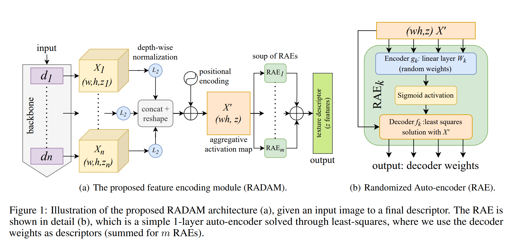
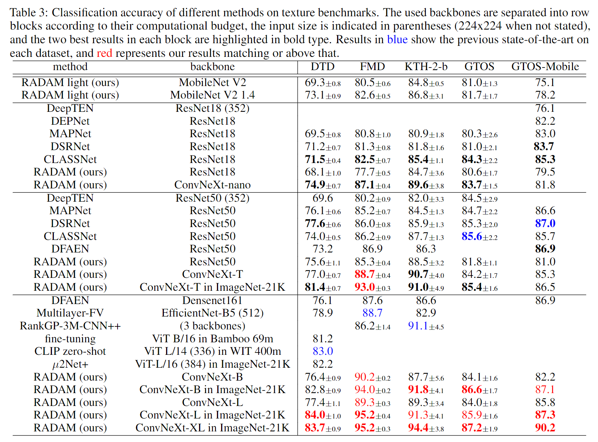
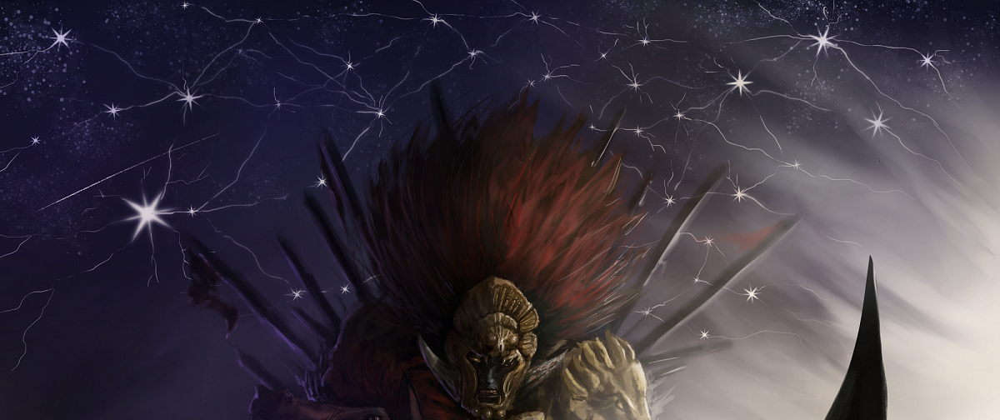

# RADAM: Texture Recognition through Randomized Aggregated Encoding of Deep Activation Maps
 
 https://arxiv.org/abs/2303.04554
 
RADAM uses deep neural networks available in ```timm==0.6.7``` for texture feature extraction, and then "classic" machine learning classification is done with ```scikit-learn``` classifiers. Several dataloaders are available for texture benchmarks, see ```datasets.py```. RADAM works practically with any architecture compatible with timm's ```features_only=True``` mode. See ```standalone_RADAM_example.py``` for getting started.

<p align="center">
    
</p>

RADAM achieves state-of-the-art texture analysis performance without ever fine-tuning the pre-trained backbones, and using only a linear SVM for classification.

<p align="center">
    
</p>

## Usage of the RADAM module

* Check ```standalone_RADAM_example.py```
```python
net = timm.create_model(model, features_only=True, pretrained=True, output_stride=8)
texture_representation = RADAM(device, z, (w,h))(net(input_batch))
```

## Requirements

* conda version : 4.10.3
* python version : 3.9.5.final.0
* And everything else inside requirements.yml

```
conda env create -f requirements.yml
conda activate timm_tfe
```
## Setup used for experiments

* Linux Ubuntu x86-64 18.04.5 LTS (Bionic Beaver)
* Intel(R) Core(TM) i7-7820X CPU @ 3.60GHz, 64GB RAM
* GTX 1080 ti, NVIDIA driver Version: 470.141.03, CUDA Version: 11.4

## Additional resources

* Dataloaders for many texture datasets, see ```datasets.py```
* Scripts for experimentation, see ```classify_features.py``` and others

## Usage of the script for experiments
* See ```python classify_features.py --help``` for usage information. An example with RADAM:

```
python classify_features.py --model convnext_nano --pooling RAEspatial --M 4 --depth all --dataset DTD --data_path /datasets/ --output_path /results/
```

Pay attention to args: 

 * ```--data_path``` (path to load/download datasets)
 * ```--output_path``` (path to save extracted features and classification results, need 2 subfolders inside: feature_matrix/ and classification/)


## Credits

If you use our code or methods, please cite the paper:

L. Scabini, K. Zielinski, L. Ribas, W. Gonçalves, B. De Baets, and O. Bruno. RADAM: Texture recognition through randomized aggregated encoding of deep activation maps. arXiv preprint arXiv:2303.04554, 2023.

```
@article{scabini2023radam,
  title={RADAM: Texture Recognition through Randomized Aggregated Encoding of Deep Activation Maps},
  author={Scabini, Leonardo and Zielinski, Kallil M and Ribas, Lucas C and Gonalves, Wesley N and De Baets, Bernard and Bruno, Odemir M},
  journal={Pattern Recognition},
  pages={109802},
  year={2023},
  publisher={Elsevier}
}
```   

____________________________________________________________________________________________________________________________________________ 

 <p align="center">
    
</p>
