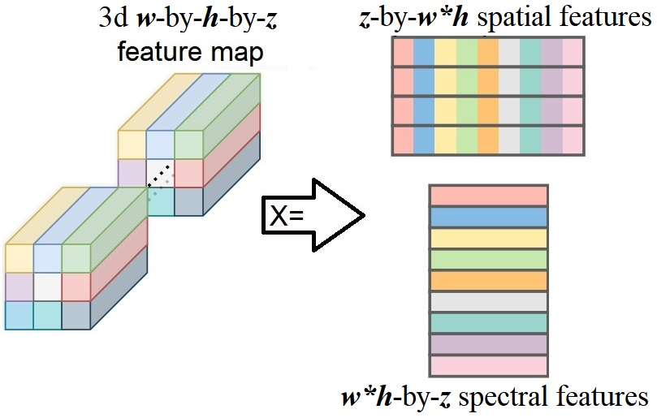
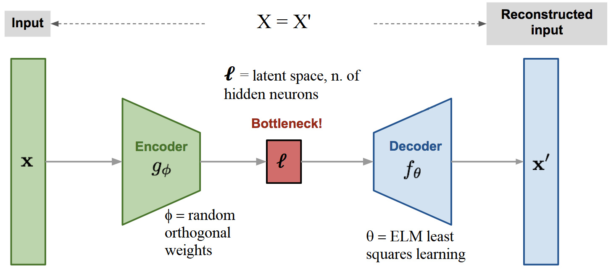

# Texture feature extraction with timm models
 
Uses deep neural networks available in ```timm``` for texture feature extraction, and then "classic" machine learning classification is done with ```scikit-learn``` classifiers. Several dataloaders are available for texture benchmarks, see ```datasets.py```


<!--
Reproducing exactly the same results of the paper is difficult in some cases, as it depends on a series of factors like the GPU and processor model, OS version, etc. We provide all the details of our setup for the reported experiments. However, if your configuration is not literally the same as described, we cannot guarantee that the exact same results will be achieved, even in similar setups. E.g., we tested cases where the only difference was the processor model (everything else, including the GPU model, was the same), and the results slightly varied in some cases. These differences happens during the forward pass of the Neural Networks, i.e., some features will be slightly different, leading to different classification results. In order to avoid that, we also provide the features computed using our setup (check... !!! WE NEED TO INCLUDE A LINK TO THE FEATURES, OR SOMETHING !!!), which will lead to the same classification results using the same sklearn version and seeds.  
-->


## Requirements

* conda version : 4.10.3
* python version : 3.9.5.final.0
* And everything else inside requirements.yml

```
conda env create -f requirements.yml
conda activate timm_tfe
```
## Setup used for experiments

* Linux Ubuntu x86-64 18.04.5 LTS (Bionic Beaver)
* Intel(R) Core(TM) i7-7820X CPU @ 3.60GHz, 96GB RAM
* GTX 1080 ti, NVIDIA driver Version: 470.141.03, CUDA Version: 11.4

## Available resources

* datasets: USPtex, LeavesTex1200, MBT, Outex (working only for 13 and 14), DTD, FMD and KTH-TIPS2-b
* models: any architecture compatible with timm features_only mode


## Usage
* See ```python classify_features.py --help``` for usage information

```
python classify_features.py --model resnet18 --dataset DTD --data_path /datasets/ --output_path /results/
```

Pay attention to args: 

 * ```--data_path``` (path to load/download datasets)
 * ```--output_path``` (path to save extracted features and classification results, need 2 subfolders inside: feature_matrix/ and classification/)
 
 
## Ideas for the new method 
* Given a trained backbone, feature maps can be obtained from the output of its layers. 

<p align="center">
    
</p>

* After obtaining a matrix (rows=samples, columns=features) from the feature map, an ELM auto-encoder can be trained:

<p align="center">
    
</p>

* The main idea is to use the ELM auto-encoder as a pooling layer, doing global pooling.
  * IDEA 1: If the spatial matrix is used to train the ELM and ℓ = z = number of channels of the feature map, we can use the average output of the latent space to obtain a feature vector of size ℓ=z. This vector can be used as the representation of the feature map. ℓ can be modified to reduce/increase the the feature vector.
  * IDEA 2: If the spectral matrix is used to train the ELM and ℓ = 1, we can use the flattened weight vector θ as a feature vector of size z. Increasing ℓ will increase the number of features by ℓ*z